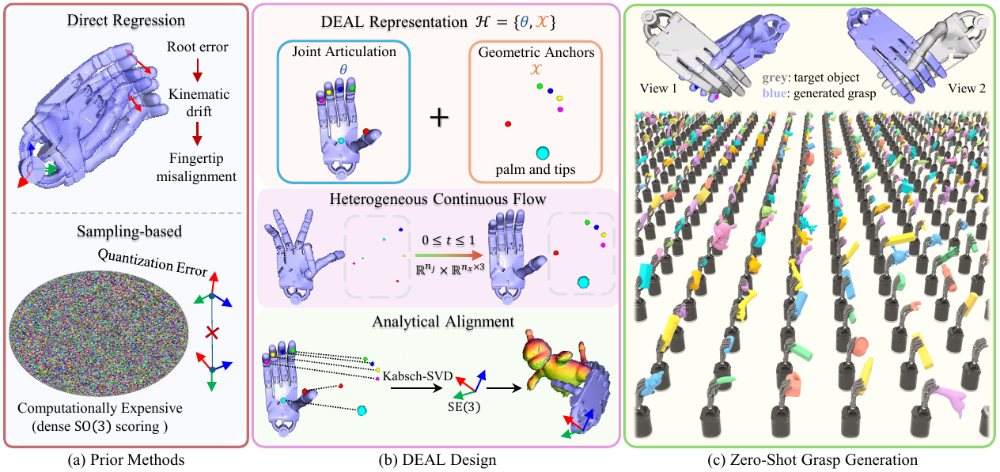

# DEAL-Grasp: Decoupled Alignment Representation for Geometry-Aware Dexterous Grasp Generation

<div align="center">

[](https://wmtlab.github.io/DEAL-Grasp/)
[](https://arxiv.org/abs/2609.28131)
[](LICENSE)

</div>

This repository hosts the official implementation of **DEAL-Grasp**, a generative framework for dexterous grasp synthesis grounded in decoupled alignment state modeling and continuous flow matching.

---

## Overview

<p align="center">
  
</p>

Synthesizing realistic articulated hand-object interactions is a fundamental problem in virtual reality, embodied intelligence, and digital human applications. We propose the Decoupled Alignment (**DEAL**) representation, which reformulates dexterous grasp synthesis as alignment-space generation: heterogeneous-state flow matching learns component-wise vector fields over task-space geometric anchors and articulation parameters, from which the rigid transform is recovered via closed-form Procrustes alignment. The resulting grasps attain high force-perturbation success rates alongside minimal penetration and high diversity, without test-time optimization or auxiliary physical guidance.

---

## Repository Roadmap

- ✅ Project page and interactive demonstrations
- ✅ arXiv preprint
- ⏳ Pretrained weights with inference and evaluation code
- ⏳ Full training code


*The codebase is under active cleanup and will be rolled out progressively.*

---

## Citation

If you find our work useful in your research, please consider citing:

```bibtex
@misc{zhao2026dealgraspdecoupledalignmentrepresentation,
  title={DEAL-Grasp: Decoupled Alignment Representation for Geometry-Aware Dexterous Grasp Generation},
  author={Fuqiang Zhao and Qian Liu},
  year={2026},
  eprint={2609.28131},
  archivePrefix={arXiv},
  primaryClass={cs.RO},
  url={https://arxiv.org/abs/2609.28131},
}
```